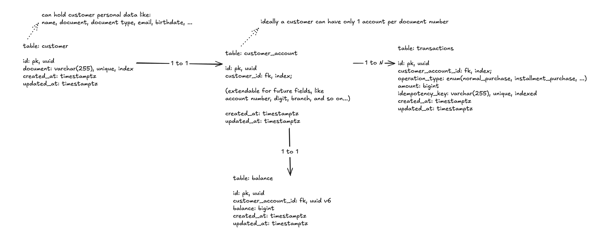

# Accounts API

Accounts API is a API for managing customer accounts and transactions.

## Architecture and decisions taken



The spec commented about two main entities:

- Account: This entity is responsible for managing the customer accounts.
- Transaction: Will hold the transactions for the account.

I decided to segregate the Account entity into two different entities: Customer and CustomerAccount to have a better separation of concerns, since the Customer entity is responsible for managing the customer information and the CustomerAccount entity is responsible for managing the customer account information, that are two different things.

This layout allow us to expand the customer_account table to hold more information about the customer account, like the account number, account type, account status, etc.
And in the future, if for some reason the bank institution decides that a customer can have more than one account, we can easily expand the customer_account table to hold more information about the customer accounts.
Meanwhile, the Customer entity is responsible for managing the customer information, like the customer name, document, email, phone, etc.

For the transactions table, I decided to use the Operation Type as a enum to avoid having to store the operation type in the transaction table, as it's easier and simple to manage the operation types in the codebase (and avoid more JOIN operations).

The balance table was a bonus feature, since we're dealing with transactions/money I thought it would be a good idea to have a balance table to keep track of the balance of the customer account under the hood.

The idempotency key on the transactions table was also a bonus feature, since we're dealing with transactions/money I thought it would be a good idea to have a idempotency key to prevent duplicate transactions. As it was not mandatory, I let it as an optional field.

### Project structure

```plaintext
├── /cmd........................: Contains the entry point of the application
│   └── main.go.................: Application entry point
├── /db.........................: Database-related code and migrations
│   ├── /migrations.............: SQL migration files
│   ├── migrations.go...........: Migration runner implementation
│   └── postgresql.go...........: PostgreSQL connection setup
├── /docs.......................: Project documentation
│   ├── openapi.yaml............: OpenAPI specification
│   └── /resources..............: Documentation assets (diagrams, images)
├── /internal...................: Go convention for private application code
│   ├── /api....................: API layer (handlers, services, DTOs)
│   │   ├── /accounts...........: Account-related endpoints
│   │   └── /transactions.......: Transaction-related endpoints
│   ├── /config.................: Application configuration and setup
│   ├── /models.................: Domain models/entities
│   ├── /pkg....................: Internal helper packages
│   │   ├── /cerror.............: Custom error handling
│   │   ├── /utils..............: Utility functions
│   │   └── /validator..........: Request validation
│   └── /repository.............: Data access layer (database operations)
├── /test.......................: Test files
│   └── /integration............: Integration tests
└── /.github/workflows..........: CI/CD pipeline configuration
```

I tried to follow the Go convention for the project structure, and also implement a kind of hexagonal architecture, with the API layer, the domain layer and the data access layer.

Each package is a module for handling a specific responsibility, for example the accounts package is responsible for handling customer accounts related operations.

Inside each module, you'll find the following files:

- `handler.go`: Responsible for handling the HTTP requests, initial payload validation/parsing, responses and transformation from the domain layer to the API layer.
- `service.go`: Responsible for handling the business logic.
- `domain.go`: Responsible for defining the domain entities, to not expose the database models straight to the API layer.
- `request.go`: Responsible for defining the request payloads for the API layer.
- `response.go`: Responsible for defining the response payloads for the API layer.

Besides that, I separated the models and repositories into different packages, since they are usually used in multiple modules, and it's easier to avoid circular dependencies.

## Running the project

You will need to have Docker (and Docker Compose) installed and running on your machine.

### Docker

You can easily run the project using Docker Compose, by running:

```bash
docker compose up -d
```

It will setup the postgres database, the API on the url `http://localhost:8889` and the Swagger UI on the url `http://localhost:8081`.

### Makefile

For this option, you will need to have Go 1.25.6 installed on your machine, support to `make` and the Docker CLI installed, to create the database container.

To install Go, you can use asdf version manager, by running:

```bash
asdf install golang 1.25.6
```

After that, you can install the dependencies by running:

```bash
make install
```

To create the database container, you can run:

```bash
docker compose up -d postgres
```

And to run the project, run the following command:

```bash
make run
```

## Testing

I decided to not write any unit tests for this project, since most of it's business logic is binded to the database layer, and the API layer, and we would be mocking good parts of the codebase behavior.

Taking that into account, I wrote some integration tests to cover the main use cases of the API. You can run them by running:

```bash
make integration-test
```

> 🚨 Just be aware that you need to have the database container running to run the tests.

## CI/CD

I've configured a CI/CD pipeline to run the tests and linting on every push to the main branch. You can see the pipeline configuration in the `.github/workflows/ci.yml` file.

The pipeline is configured to run on every push to the main branch, and on every pull request to the main branch.

## Notes, next steps and considerations

- Today the API layer is a little bit coupled to the domain layer, since the request is being passed straight to the domain layer, ideally if we would like to make things very decoupled and "loyal" to the hexagonal or some onion architecture, we would need to create a kind of adapter layer to handle the request and response transformations, and create much more boilerplate code, that wouldn't be worth it for this small project.
- Also, I created a package to handle errors in a more structured way, using a "common error" pattern. Today it adds http behaviors to the domain layer, that is not so aproppriate, but it's a good way to start handling errors with a more structured approach.
- As I added the balance table, I also had to implement a lock strategy to avoid race conditions when updating the balance, using the `FOR UPDATE` clause in the SQL query.
- The tests organization today are a little bit messy, would be nice to better organize them in the future and make things more modular and easier to maintain.
- And thinking about deploying this application to a production environment, we would need to add some things like:
  - Authentication: since today everyone can create an account and make transactions, we would need to add some kind of authentication to the API.
  - Monitoring: we could use prometheus to send stats about the API, like requests per second, error rates, etc. And use Grafana to visualize the metrics.
  - Error tracking: we could use Sentry to track errors and send notifications to the team.
